# Azure SRE Agent Demo Environment - Terraform

このTerraform構成は、Azure SRE Agent デモ環境をプロビジョニングします。

## アーキテクチャ

この構成では、2つのリソースグループを使用してリソースを分離しています：

- **監視対象リソースグループ** (`rg-sre-agent-demo`): SRE Agentが監視するアプリケーションリソース
- **SRE Agentリソースグループ** (`rg-sre-agent`): SRE Agent専用のリソース

```mermaid
graph TB
    subgraph GitHub
        REPO[("📦 Repository<br/>(Private)")]
    end

    subgraph Azure
        subgraph RG1["📁 rg-sre-agent-demo"]
            LAW["📊 Log Analytics<br/>Workspace"]
            AI["📈 Application<br/>Insights"]
            ALERT["🔔 Alert Rules"]
            ASP["⚙️ App Service Plan<br/>(B1)"]
            APP["🌐 App Service<br/>(.NET 10.0)"]
        end

        subgraph RG2["📁 rg-sre-agent"]
            SLAW["📊 Log Analytics<br/>Workspace"]
            SAI["📈 Application<br/>Insights"]
            UAI["🔑 User Assigned<br/>Identity"]
            SRE["🤖 Azure SRE Agent<br/>(Preview)"]
        end
    end

    %% Connections
    REPO -->|"CI/CD"| APP
    APP -->|"テレメトリ"| AI
    AI --> LAW
    AI --> ALERT
    SRE -->|"監視"| RG1
    SRE --> SAI
    SAI --> SLAW
    UAI -.->|"認証"| SRE
```



## 作成されるリソース

### 監視対象リソースグループ

| リソース | 説明 | SKU/Tier |
|---------|------|----------|
| Log Analytics Workspace | ログ収集・分析 | PerGB2018 (30日保持) |
| Application Insights | アプリケーション監視 | Log Analytics統合 |
| Smart Detector Alert Rule | 障害異常検知 | - |
| Metric Alert Rule | 例外アラート | - |
| Action Group | アラート通知 | - |
| App Service Plan | Webアプリホスティング | B1 (Basic) |
| App Service (Linux) | Webアプリケーション | .NET 10.0 |

### SRE Agentリソースグループ

| リソース | 説明 | SKU/Tier |
|---------|------|----------|
| Log Analytics Workspace | SRE Agent用ログ | PerGB2018 (30日保持) |
| Application Insights | SRE Agent用監視 | Log Analytics統合 |
| User Assigned Identity | SRE Agentマネージド ID | - |
| Azure SRE Agent | AI駆動のSRE支援 | Preview (eastus2) |

### GitHub
| リソース | 説明 |
|---------|------|
| GitHub Repository | プライベートリポジトリ |

## 前提条件

- Terraform >= 1.5.0
- Azure CLI (ログイン済み: `az login`)
- GitHub CLI (ログイン済み: `gh auth login`)
- Azure サブスクリプション

## 使用方法

### 1. 変数ファイルの準備

```bash
cp terraform.tfvars.example terraform.tfvars
```

`terraform.tfvars` を編集して必要な値を設定してください。

### 2. 初期化

```bash
terraform init
```

### 3. プラン確認

```bash
terraform plan
```

### 4. プロビジョニング

```bash
terraform apply
```

### 5. 削除

```bash
terraform destroy
```

## 変数

### 必須変数

| 変数名 | 説明 |
|--------|------|
| `subscription_id` | Azure サブスクリプションID |
| `github_owner` | GitHub ユーザー名または組織名 |

### オプション変数

| 変数名 | デフォルト | 説明 |
|--------|-----------|------|
| `resource_group_name` | `rg-sre-agent-demo` | 監視対象リソースグループ名 |
| `sre_agent_resource_group_name` | `rg-sre-agent` | SRE Agent用リソースグループ名 |
| `location` | `japaneast` | Azureリージョン |
| `project_name` | `sreagent` | プロジェクト名（リソース命名に使用） |
| `environment` | `dev` | 環境名（dev, staging, prod） |
| `github_repo_name` | `azure-sre-agent-demo` | GitHubリポジトリ名 |
| `github_push_source_dir` | `./app` | GitHubにプッシュするソースディレクトリ |
| `github_push_commit_message` | `Initial commit from Terraform` | コミットメッセージ |
| `tags` | (デフォルトタグ) | リソースに適用するタグ |
| `sre_agent_name` | `sre-agent` | SRE Agent名 |
| `sre_agent_access_level` | `High` | アクセスレベル（High/Low） |
| `sre_agent_action_mode` | `Review` | アクションモード（Review/Auto） |

## コスト最適化

この構成はデモ用途向けに設計されています。極力コストを抑える構成にしていますが、若干のコストが発生しますのでご注意ください。

- **App Service**: B1 (Basic tier、Always On有効)
- **Log Analytics**: 日次クォータ 1GB、30日保持
- **Application Insights**: 日次キャップ 1GB、サンプリング100%

## 注意事項

1. **Azure SRE Agent** はプレビュー機能です（`Microsoft.App/agents@2025-05-01-preview`）。APIバージョンやスキーマが変更される可能性があります。
2. SRE Agentは現在限定されたリージョンのみでデプロイ可能です。本リポジトリでは `eastus2` を使用しています。
3. GitHub認証は `gh auth login` による認証を使用します。
4. 本番環境では、より高いSKUとセキュリティ設定を検討してください。
5. App Serviceの継続的デプロイにはBasic tier以上が必要です（Free tierでは不可）。

## ファイル構成

```
terraform/
├── versions.tf              # Terraformとプロバイダーのバージョン
├── providers.tf             # プロバイダー設定 (azurerm, azapi, github, random)
├── variables.tf             # 入力変数
├── main.tf                  # リソースグループ、ランダムサフィックス、ローカル変数
├── log_analytics.tf         # Log Analytics Workspace (監視対象用)
├── app_insights.tf          # Application Insights、アラートルール、アクショングループ
├── app_service.tf           # App Service Plan & Web App (継続的デプロイ設定含む)
├── sre_agent.tf             # Azure SRE Agent (AzAPI)、専用Log Analytics/App Insights
├── github.tf                # GitHub Repository & ファイルプッシュ
├── terraform.tfvars.example # 変数サンプル
├── app/                     # デモアプリケーション (.NET Blazor)
└── README.md                # このファイル
```
